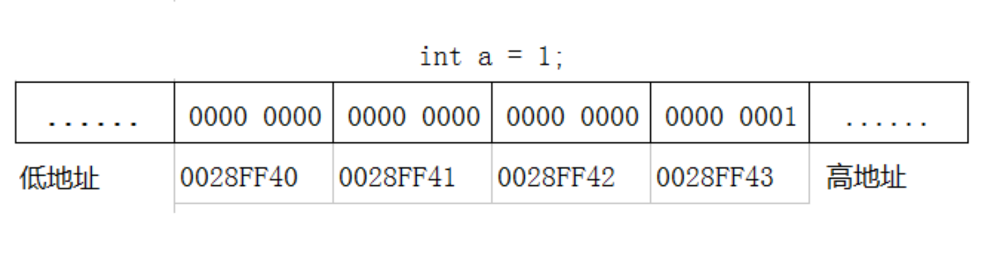
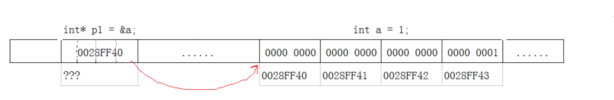

## 15.1 概述
C/C++语言之所以强大，以及其自由性，很大部分体现在其灵活的指针运用上。因此，说指针是C/C++语言的灵魂一点都不为过。 有好的一面，必然会有坏的一面，指针的灵活导致了它的难以控制，所以C/C++程序员的很多bug是基于指针问题上的。

### 15.1.1 指针是什么？
指针是“指向（point to）”另外一种类型的复合类型。复合类型是指基于其它类型定义的类型。
理解指针，先从内存说起：内存是一个很大的，线性的字节数组。每一个字节都是固定的大小，由8个二进制位组成。最关键的是，每一个字节都有一个唯一的编号,编号从0开始，一直到最后一个字节。
程序加载到内存中后，在程序中使用的变量、常量、函数等数据，都有自己唯一的一个编号，这个编号就是这个数据的地址。

指针的值实质是内存单元（即字节）的编号，所以指针单独从数值上看，也是整数，他们一般用16进制表示。指针的值（虚拟地址值）使用一个机器字的大小来存储。也就是说，对于一个机器字为w位的电脑而言，它的虚拟地址空间是0~[2^w] - 1，程序最多能访问2的w次幂个字节。这就是为什么xp这种32位系统最大支持4GB内存的原因了。
因此可以理解为：指针是程序数据在内存中的地址，而指针变量是用来保存这些地址的变量。
### 15.1.2 变量在内存中的存储
举一个最简单的例子 int a = 1，假设计算机使用大端方式存储：

内存数据有几点规律：
1、计算机中的所有数据都是以二进制存储的
2、数据类型决定了占用内存的大小
3、占据内存的地址就是地址值最小的那个字节的地址。
现在就可以理解 a 在内存中为什么占4个字节，而且首地址为0028FF40了。
### 15.2 指针对象自身（变量）
用来保存指针的对象，就是指针对象。如果指针变量p1保存了变量 a 的地址，则就说：p1指向了变量a，也可以说p1指向了a所在的内存块 ，这种指向关系，在图中一般用 箭头表示:

指针对象p1，内容就是用来存储指向的变量的内存地址。也有自己的内存空间，32位机器占4个字节，64位机器占8个字节。所以会有指针的指针。